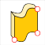
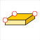
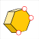
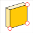

# Solid Sketch for Rhino - simple solids 

"RhinoSketch" librray for simple quasi-solid and parametric objects.

 /Command: Create solid along curve or polygon.
 /Command: Create horizontal rectangular solid. 
 /Command: Create horizonatal shape by polygon boundary.
 /Command: Create solid in a vertical position.

What does quasi solid object mean? 
The script generate planar surfaces that are grouped together. 

Why do not you go with real solid object?
The surface group gives the possibility to apply different materials on each side of the object that is not possible with solid objects.

Technical:
Scrips are developed in Rhinoceros 5.
