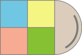
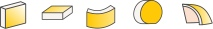
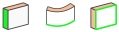

# Solid Sketch for Rhino - Simple solid geometry processing 
 

"RhinoSketch" for parametric grouped surfaces.

Create geometry:

  

● Create rectangular vertical solid element. 
● Create rectangular horizontal solid element. 
● Create solid along curve or polygon. 

Modify geometry:

  

● Create solid along curve or polygon. 

#  FAQ 

** Why do not you go with real solid object? ** 
The surface group gives the possibility to apply different materials on each side of the object that is not possible with solid objects.

Technical:
Scrips are developed in Rhinoceros 5.
